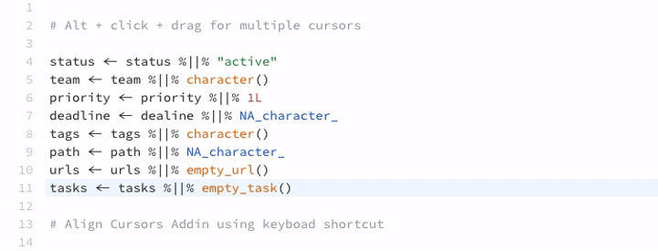

# AlignAssign

[](https://travis-ci.org/seasmith/AlignAssign)

Align the assignment operators (either `<-` or `=`) within a highlighted area.

Before:
```{r, eval=FALSE}
a <- 1:5
bbb <- 6:10
c <- letters
```

After:
```{r, eval=FALSE}
a   <- 1:5
bbb <- 6:10
c   <- letters
```


#### Align Cursors

For alignment of any text, you can align multiple cursors with the **Align Cursors** addin.
Add multiple cursors to your document by holding <kbd>Ctrl</kbd>/<kbd>Cmd</kbd> + <kbd>Alt</kbd> and clicking in the RStudio editor, or by holding <kbd>Alt</kbd> and clicking and dragging the mouse.



### What
AlignAssign contains three addins. Two addins align all of either the  `<-` (`Align Assign`) or `=` (`Align Assign 2`) assignment operators within a highlighted region and the third aligns multiple cursors across lines to the same column. 

None of the addins "reflow" your code if the alignment breaks the page width. They also does not treat commented lines differently to uncommented lines. __If there is either one of the assignment operators within a highlighted comment line, then it will either align that operator or align other operators to it.__

## Install
```{r install, eval=FALSE}
devtools::install_github("seasmith/AlignAssign")
```

You can assign each alignment addin action to a specific keyboard shortcut in RStudio in the *Modify keyboard shortcuts...* menu option under the *Tools* menu.

## Examples

#### Align `<-`'s with Align Assign
When you highlight the following chunk of code (region) - whether you highlight the entirity or just a portion of the first and last lines - and then run the `Align Assign` addin...
```{r, eval=FALSE}
# This is a commented line
# So is this
a <- 1:5
b <- 6:10
copy_a <- a
# More comments
```

...the result will look like this.
```{r, eval=FALSE}
# This is a commented line
# So is this
a      <- 1:5
b      <- 6:10
copy_a <- a
# More comments
```

#### Align `=`'s with Align Assign 2
The above example also works for the `=` operator when using the other addin, `Align Assign 2`. Before...
```{r, eval=FALSE}
# Perosnal information
list(surname = "Crichton",
     firstName = "John",
     address = NA,
     occupation = "fugitive")
```

...after.
```{r, eval=FALSE}
# Perosnal information
list(surname    = "Crichton",
     firstName  = "John",
     address    = NA,
     occupation = "fugitive")
```

#### Behavior of commented-out assignment operators
Be mindful that highling a chunk of code which has assignment operators within commented lines, like the following, and running the `Align Assign 2` addin...
```{r, eval=FALSE}
# This is a commented line with an assignment operator <-
a <- 1:5
b <- 6:10
c <- 11:15
# There is an assignment operator <- here, too
```

...will result in something like this.
```{r, eval=FALSE}
# This is a commented line with an assignment operator <-
a                                                      <- 1:5
b                                                      <- 6:10
c                                                      <- 11:15
# There is an assignment operator                      <- here, too
```

#### Not so smart aligner
There is also no special handling of assignment operators within a function. So, if you highlighted the entire chunk below and then ran the `Align Assign` addin...
```{r, eval=FALSE}
var1 <- letters
var2 <- as.list(sample(1:26, 26))
names(var2) <- var1[unlist(var2)]
list.pos <- function(name, lst){
    matches <- sapply(name, function(x){
        matched <- which(names(lst) %in% x)

        if(length(matched) == 0) matched <- NA
        matched
    })
    return(matches)
}
positions <- list.pos(c("a", "bbb", "c"), var2)
```

...the result will look like this.
```{r, eval=FALSE}
var1                                     <- letters
var2                                     <- as.list(sample(1:26, 26))
names(var2)                              <- var1[unlist(var2)]
list.pos                                 <- function(name, lst){
    matches                              <- sapply(name, function(x){
        matched                          <- which(names(lst) %in% x)

        if(length(matched) == 0) matched <- NA
        matched
    })
    return(matches)
}
positions                                <- list.pos(c("a", "bbb", "c"), var2)
```
